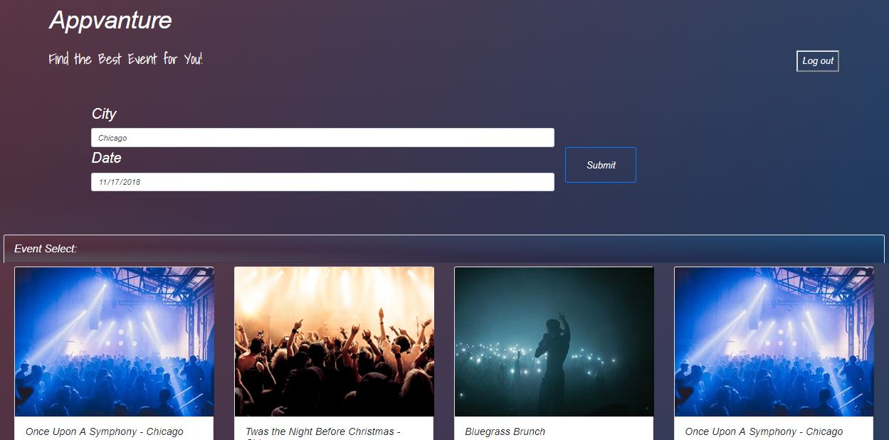

# Appvanture
This is a mix of event searcher and social communicator. a platform where users can connect over an event.

As human beans, we like to socialize, and going to events alone is never fun.
imagine you are in a new city, or maybe none of your friends are free during the weekend or maybe you just have other interest than anyone around you. our platform gives you the chance to connect with people with the same interest over events such as concert, theater, sports events and more.



## Table of Contents

- [Folder Structure](#folder-structure)
- [Version](#version)
- [How does it work](#how-does-it-work)
- [Installation](#installation)
- [Deployment](#deployment)

## Folder Structure

This is the project structure:

```
│  index.html
│  README.md
│
└───assets
    ├───css
    │      style.css
    ├───images
    └───js
           javascript.js
```

## Version

1.0.0.

## How does it work

1. Get in by signing up and then sgining in
2. Search event by entering the city and date you are intrested in
3. Pick an event
4. See which people showed interest in that event, and chat with them

## Installation

### Clone

- Clone this repo to your local machine. 

### Setup

- Set up your database by open a Firebase account, and change the Firebase script in your HTML

- Beside that no need for any installation, just open the index.html on your browser

## Deployment

* [GitHub](https://erandro.github.io/Appvanture/)

## Authors

* **Eran Dromy** - *Project manager, Information Architect, API, UX* - [GitHub](https://github.com/erandro)
* **Peter Kohler** - *Authorisation, Database* - [GitHub](https://github.com/peterkohler95)
* **Xinting Yu** - *Front End Development* - [GitHub](https://github.com/xintingyu0828)

## Acknowledgments

* Michael Doherty
* Poornima Sewak
* Nelly Sugu